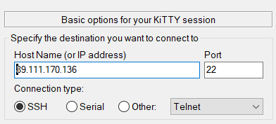
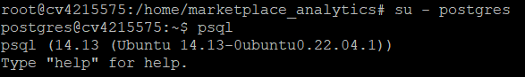
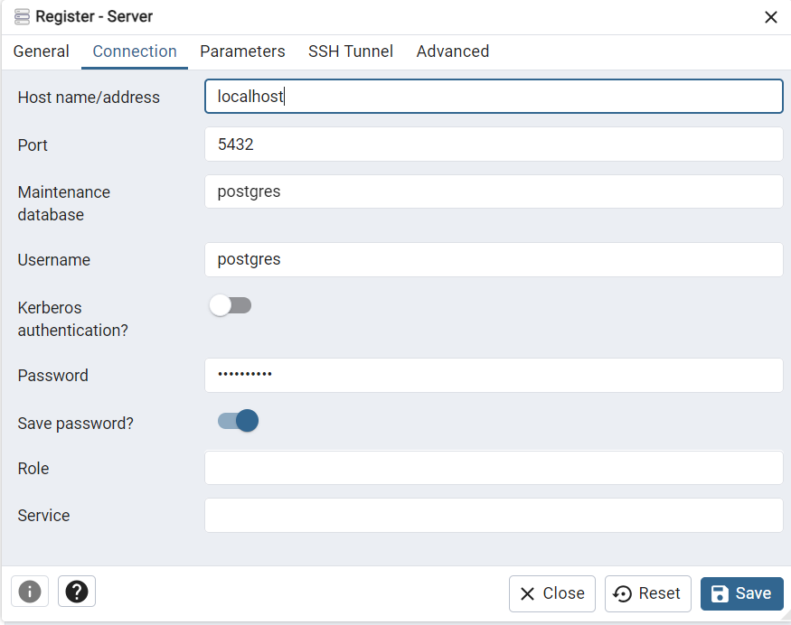
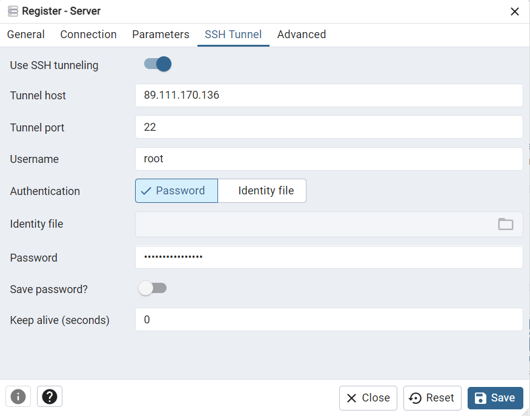
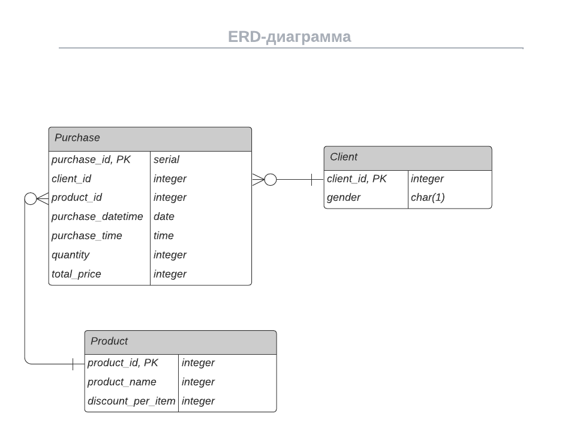

# Аналитика продаж онлайн-маркетплейса

## Задачи проекта

1. Насписать скрипт, для сбора данных по API. 

2. Настроить сервер и развернуть на нем базу данных для хранения информации

3. Настроить скрипт, чтобы он ежедневно в 7 утра забирал данные за предыдущий день 

4. Единоразово написать и запустить скрипт, который первично заполнит базу всеми историческими данными, которые уже доступны в API на момент написания скрипта

5. Установить Metabase, подключить его к базе и собрать дашборд для оперативного отслеживания основных метрик по активности клиентов, ассортиментной матрицы, продажам и так далее

## Как запустить проект

1. Создать виртуальный сервер, например на рег.ру. Подойдёт базовый тариф, оптимальный объем RAM - 2 Гб.

2. Подключиться к серверу по SSH



3. На сервере склонировать данный репозиторий

```
cd ../home
git clone https://github.com/emshen6/marketplace_analytics.git
cd marketplace_analytics
```

4. Установить python 3.11 и необходимые пакеты

```
apt-get update
apt-get install python3.11
apt-get install python3.10-venv
apt install python3-pip
apt-get install -y install postgresql
```

5. Создать и активировать venv

```
python3 -m venv venv
source venv/bin/activate
```

6. Установить библиотеки

```
pip install -r requrements.txt
```

7. Залогиниться под postgres и проверить установку postgresql



8. Поменять пароль пользователя postgres, дабы избежать в будещем


9. Перейти обратно в проект и добавить файл config.ini вида

```
[API]
API_URL = ...
[Files]
DATA_PATH = purchase_data.json
LOG_PATH = app.log
[Database]
HOST = localhost
DATABASE = marketplace
USER = postgres
PASSWORD = password
```

10. С помощью любой платформы для администрирования СУБД создать SSH-тунель к серверу и подключиться




11. Создать базу данных, имя которой указано в config.ini

12. Создадим три таблицы

```
CREATE TABLE Clients (
    client_id INT PRIMARY KEY,
    gender CHAR(1)
);

CREATE TABLE Products (
    product_id INT PRIMARY KEY,
    product_name VARCHAR(255),
    price_per_item INT,
    discount_per_item INT
);

CREATE TABLE Purchases (
    purchase_id SERIAL PRIMARY KEY,
    client_id INT,
    product_id INT,
    purchase_datetime DATE,
    purchase_time TIME,
    quantity INT,
    total_price INT,
    FOREIGN KEY (client_id) REFERENCES Clients(client_id),
    FOREIGN KEY (product_id) REFERENCES Products(product_id)
);
```

и индексы

```
CREATE INDEX idx_client_id ON Purchases(client_id);
CREATE INDEX idx_product_id ON Purchases(product_id);
```

